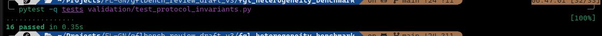
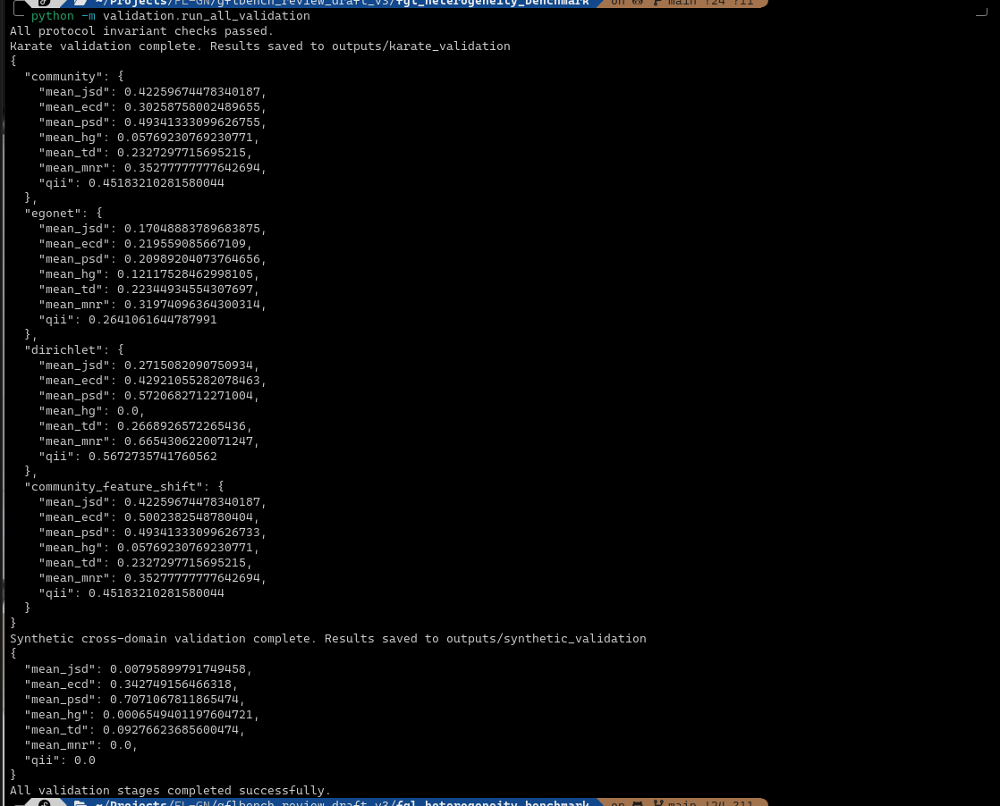

# FGL Heterogeneity Benchmark

A manuscript-ready validation repo for benchmarking non-IID data in federated graph learning.

## What is included

This package implements:

- the recommended metric suite M1--M8
- the deterministic partition protocols P1--P5
- boundary-edge policies for subgraph federations
- manifest generation and hashing for reproducible releases
- self-contained validation scripts on:
  - Karate Club graph for node/subgraph settings
  - synthetic multi-domain graph collections for cross-domain settings

## Geting Started
1. Creat a virtual environment

```bash
python -m venv fgl_heterogeneity
source fgl_heterogeneity/bin/activate  # On Windows: fl_gcn\Scripts\activate

# then git clone the project:
git clone https://github.com/danieloladele7/fgl_heterogeneity_benchmark.git 
```

2. Install

```bash
pip install -e .
```

For development tools:

```bash
pip install -e .[dev]
```

3. Run the pytest to test workflow

```bash
pytest -q tests validation/test_protocol_invariants.py
```


4. Run the validation workflow

```bash
python -m validation.run_all_validation
```



**This runs**:

* protocol invariant checks
* Karate-based validation
* synthetic cross-domain validation

Outputs are written to `outputs/`.

## Self-contained datasets in this repo

To keep the proof of concept runnable without external downloads, the validation workflow uses:

- `Karate Club` for subgraph and node-level protocol checks
- a synthetic two-domain graph collection for graph-level and cross-domain checks

A loader for `torch_geometric` datasets remains available in `fgl_heterogeneity.utils.io_utils` for later expansion to Cora, CiteSeer, PubMed, or TU datasets when network access is available.

## Example scripts

```bash
python examples/generate_partitions.py
python examples/compute_metrics.py
```

## Notebook

A proof-of-concept notebook is included under `notebooks/`.

## Suggested manuscript framing

This codebase is intended to validate that:

- each partition protocol is deterministic under a fixed seed
- each protocol satisfies basic assignment invariants
- the intended heterogeneity axis is measurably changed by the corresponding protocol
- manifests can be released and audited reproducibly

## License

MIT

## Citation
If you find this repo or the paper useful kindly cite this as:

```bibtex
@Article{iot7010013,
    AUTHOR = {Oladele, Daniel Ayo and Sibiya, Malusi and Mnkandla, Ernest},
    TITLE = {Benchmarking Non-IID Data in Federated Graph Learning: A Systematic Review of Metrics, Protocols, and Evaluation Practices},
    JOURNAL = {IEEE Access},
    VOLUME = {},
    YEAR = {2026},
    NUMBER = {},
    ARTICLE-NUMBER = {},
    URL = {https://github.com/danieloladele7/fgl_heterogeneity_benchmark.git},
    ISSN = {},
    ABSTRACT = {},
    DOI = {}
    NOTES = {Under Review IEEE Access; github link: https://github.com/danieloladele7/fgl_heterogeneity_benchmark.git}
}
```
